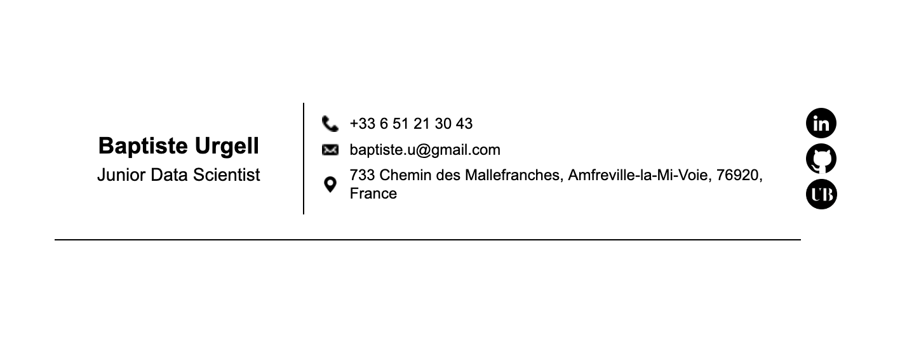

# email-signature



## How to use it on Gmail ?

1. Open signature.html file on your browser
2. * Windows / Linux: Use Ctr + A, Ctr + C
   * MacOS: Use ⌘ + A, ⌘ + C
3. Go to your gmail account and open parameters
4. In the Signature section, create a new one
5. * Windows / Linux: Use Ctr + v
   * MacOS: Use ⌘ + V
6. Save changes

## How to use it on Mail (MacOs) ?

1. Create a blank signature, tutorial <a href="https://support.apple.com/en-ie/guide/mail/mail11943/mac">here</a>, and close Mail.
2. Open System Settings, click Privacy & Security, then click Full Disk Access and add Terminal application
3. Open a terminal and enter the following command:
```shell
cd ~/Library/Mail/V{version number}/MailData/Signatures
```
4. Find the filename with .mailsignature extension of your signature based on the creation date:
```shell
ls -sl
```
5. Open the file using a text editor and replace the body content with the content of signature.html:
6. Quick way using vim:
    * Open the file
        ```shell
        vim {filename}.mailsignature
        ```
    * Delete the body line (double press d)
    * Press i to pass in insert mode
    * Write a body balise and paste the html code.
    * Press esc, :wq, ↩ to save and close the file

7. On the Terminal enter the following command to lock your signature file:
```shell
chflags uchg {file_name}.mailsignature
```
8. Open Mail and try your new signature !
9. For security reason, remove Full Disk Access to the Terminal application


## Et voilà !

nb: This signature was created to be used on a white background, modification may be necessary for another style of background